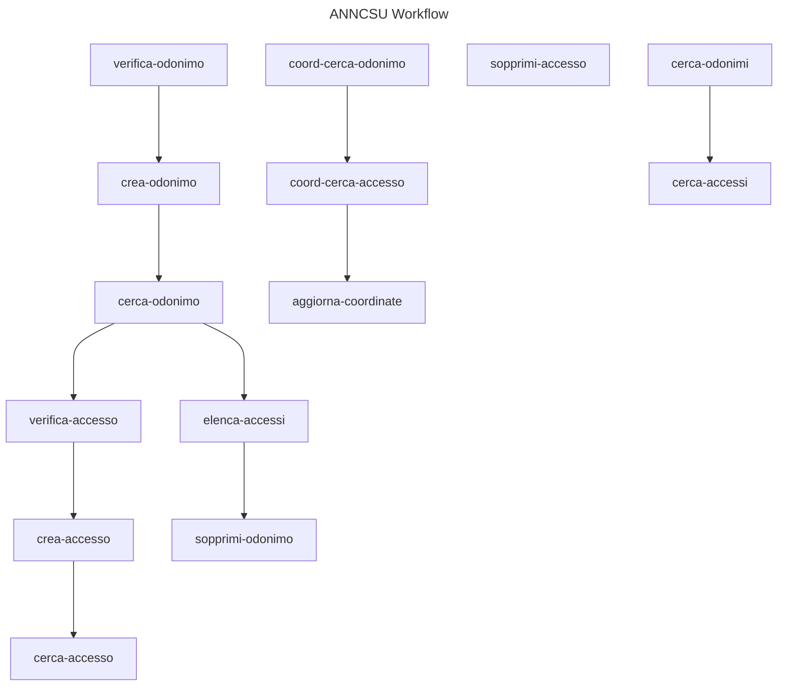

# ANNCSU Arazzo workflows

<!-- Generated by scripts/gen-docs.sh via apitapviz (pinned 3561d1c494c5c7d033551fd362e085937d138ebd).
     Do not edit by hand; rerun the script after changing the Arazzo spec.
     Step descriptions are domain content from the spec and may be in Italian. -->

## Workflow graph

## ANNCSU Workflow

Workflow per la gestione completa degli indirizzi nel sistema ANNCSU.
Include operazioni su odonimi, accessi e coordinate.

Contatto: infopdnd_anncsu@sogei.it

### 1: verifica-odonimo

Verifica se l'odonimo esiste in ANNCSU

- Operation: `anncsu-consultazione.esisteOdonimoPost`
- Outputs: odonimo_esistente

### 2: crea-odonimo

Crea l'odonimo se non esiste

- Operation: `anncsu-odonimi.gestioneAnncsuOdonimiPdnd`
- Outputs: progressivo_nazionale

### 3: cerca-odonimo

Recupera il progressivo nazionale dell'odonimo esistente

- Operation: `anncsu-consultazione.elencoodonimiprogPost`
- Outputs: progressivo_nazionale

### 4: verifica-accesso

Verifica se l'accesso (numero civico) esiste

- Operation: `anncsu-consultazione.esisteAccessoPost`
- Outputs: accesso_esistente

### 5: crea-accesso

Crea l'accesso se non esiste

- Operation: `anncsu-accessi.gestioneAnncsuPdnd`
- Outputs: progressivo_civico

### 6: cerca-accesso

Recupera il progressivo civico dell'accesso esistente

- Operation: `anncsu-consultazione.elencoaccessiprogPost`
- Outputs: progressivo_civico

### 1: coord-cerca-odonimo

Cerca l'odonimo per ottenere il progressivo nazionale

- Operation: `anncsu-consultazione.elencoodonimiprogPost`
- Outputs: progressivo_nazionale

### 2: coord-cerca-accesso

Cerca l'accesso per ottenere il progressivo civico

- Operation: `anncsu-consultazione.elencoaccessiprogPost`
- Outputs: progressivo_civico

### 3: aggiorna-coordinate

Aggiorna le coordinate dell'accesso

- Operation: `anncsu-coordinate.gestionecoordinate`
- Outputs: coordinate_aggiornate

### 1: cerca-odonimo

Cerca l'odonimo per ottenere il progressivo nazionale

- Operation: `anncsu-consultazione.elencoodonimiprogPost`
- Outputs: progressivo_nazionale, denom_completa

### 2: elenca-accessi

Elenca tutti gli accessi dell'odonimo (consumati dall'executor)

- Operation: `anncsu-consultazione.elencoaccessiprogPost`
- Outputs: lista_accessi

### 3: sopprimi-odonimo

Sopprime l'odonimo (richiede zero accessi residui)

- Operation: `anncsu-odonimi.gestioneAnncsuOdonimiPdnd`
- Outputs: risultato_soppressione

### 1: sopprimi-accesso

Sopprime l'accesso (civico) indicato

- Operation: `anncsu-accessi.gestioneAnncsuPdnd`
- Outputs: esito

### 1: cerca-odonimi

Cerca odonimi che corrispondono

- Operation: `anncsu-consultazione.elencoodonimiprogPost`
- Outputs: odonimi_trovati, progressivo_nazionale

### 2: cerca-accessi

Cerca gli accessi del primo odonimo trovato

- Operation: `anncsu-consultazione.elencoaccessiprogPost`
- Outputs: accessi_trovati
