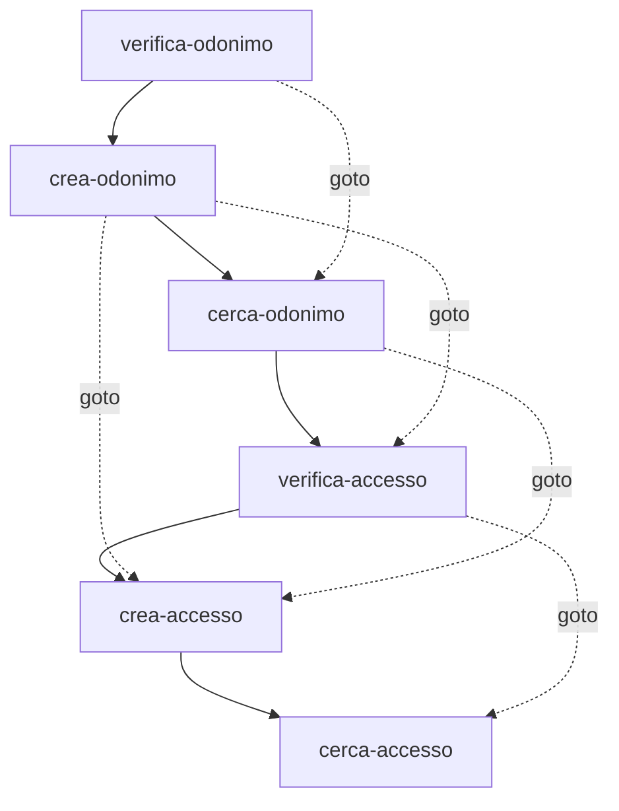
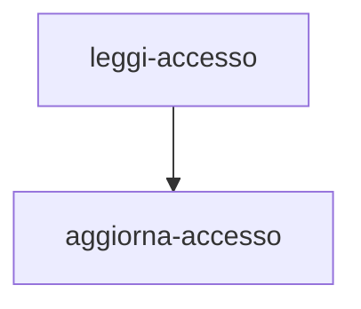
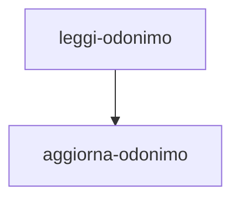
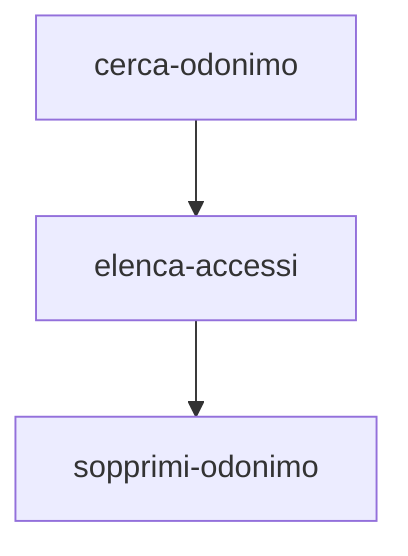
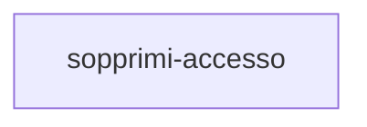
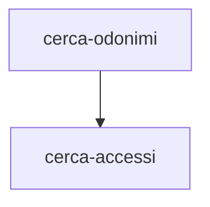

# ANNCSU Arazzo workflows

<!-- Generated by scripts/gen_workflows_doc.py from the Arazzo spec. Do not edit by hand; rerun the script after changing the spec. Step descriptions are domain content from the spec and may be in Italian. -->

Workflow di gestione degli indirizzi ANNCSU (odonimi, accessi, coordinate)

## verifica-e-crea-indirizzo-completo

Verifica l'esistenza e crea un indirizzo completo

### 1. verifica-odonimo

Verifica se l'odonimo esiste in ANNCSU

- Operation: `anncsu-consultazione.esisteOdonimoPost`
- Outputs: odonimo_esistente

### 2. crea-odonimo

Crea l'odonimo se non esiste

- Operation: `anncsu-odonimi.gestioneAnncsuOdonimiPdnd`
- Outputs: progressivo_nazionale

### 3. cerca-odonimo

Recupera il progressivo nazionale dell'odonimo esistente

- Operation: `anncsu-consultazione.elencoodonimiprogPost`
- Outputs: progressivo_nazionale

### 4. verifica-accesso

Verifica se l'accesso (numero civico) esiste

- Operation: `anncsu-consultazione.esisteAccessoPost`
- Outputs: accesso_esistente

### 5. crea-accesso

Crea l'accesso se non esiste

- Operation: `anncsu-accessi.gestioneAnncsuPdnd`
- Outputs: progressivo_civico

### 6. cerca-accesso

Recupera il progressivo civico dell'accesso esistente

- Operation: `anncsu-consultazione.elencoaccessiprogPost`
- Outputs: progressivo_civico

## aggiorna-accesso-da-progressivo

Aggiorna un accesso identificato dai progressivi nazionali

### 1. leggi-accesso

Legge lo stato attuale dell'accesso per progressivo nazionale

- Operation: `anncsu-consultazione.prognazaccPost`
- Outputs: numero, esponente, specificita, metrico, codice_civico_comunale, coord_x, coord_y, coord_z, coord_metodo

### 2. aggiorna-accesso

Sostituisce lo stato dell'accesso preservando i campi non indicati

- Operation: `anncsu-accessi.gestioneAnncsuPdnd`
- Outputs: accesso_aggiornato

## aggiorna-odonimo-da-progressivo

Aggiorna un odonimo identificato dal progressivo nazionale

### 1. leggi-odonimo

Legge lo stato attuale dell'odonimo per progressivo nazionale

- Operation: `anncsu-consultazione.prognazareaPost`
- Outputs: dug, denom_localita, denom_in_lingua_1, denom_in_lingua_2, codice_comunale

### 2. aggiorna-odonimo

Sostituisce lo stato dell'odonimo preservando i campi non indicati

- Operation: `anncsu-odonimi.gestioneAnncsuOdonimiPdnd`
- Outputs: odonimo_aggiornato

## sopprimi-odonimo-completo

Sopprime un odonimo previa soppressione degli accessi associati

### 1. cerca-odonimo

Cerca l'odonimo per ottenere il progressivo nazionale

- Operation: `anncsu-consultazione.elencoodonimiprogPost`
- Outputs: progressivo_nazionale, denom_completa

### 2. elenca-accessi

Elenca tutti gli accessi dell'odonimo (consumati dall'executor)

- Operation: `anncsu-consultazione.elencoaccessiprogPost`
- Outputs: lista_accessi

### 3. sopprimi-odonimo

Sopprime l'odonimo (richiede zero accessi residui)

- Operation: `anncsu-odonimi.gestioneAnncsuOdonimiPdnd`
- Outputs: risultato_soppressione

## sopprimi-accesso

Sopprime un singolo accesso (civico) di un odonimo

### 1. sopprimi-accesso

Sopprime l'accesso (civico) indicato

- Operation: `anncsu-accessi.gestioneAnncsuPdnd`
- Outputs: esito

## ricerca-indirizzo-completo

Ricerca completa di un indirizzo (sola lettura)

### 1. cerca-odonimi

Cerca odonimi che corrispondono

- Operation: `anncsu-consultazione.elencoodonimiprogPost`
- Outputs: odonimi_trovati, progressivo_nazionale

### 2. cerca-accessi

Cerca gli accessi del primo odonimo trovato

- Operation: `anncsu-consultazione.elencoaccessiprogPost`
- Outputs: accessi_trovati
